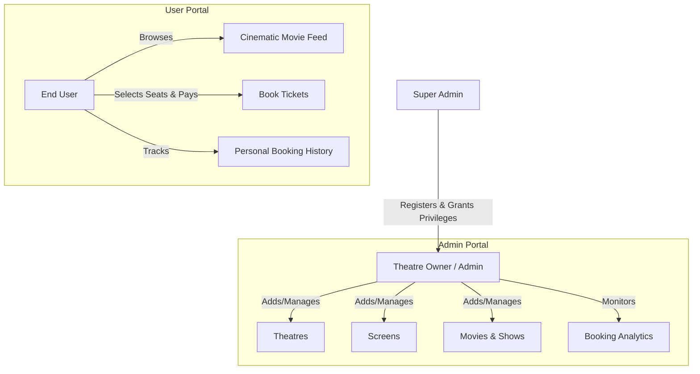

<div align="center">


<h3>🍿 A High-Performance, Full-Stack Movie Booking Architecture ⚡</h3>

<p><em>Powered by Angular 17 • Spring Boot • Spring Security • MySQL • Docker</em></p>

<p>
  
  
  
  
  
</p>

<p>
  
  
  
</p>

</div>

---

## 🌟 Overview

**CinePrestige** is an enterprise-grade, full-stack Movie Booking Application engineered to deliver a seamless, high-end user experience reminiscent of premium streaming platforms. It demonstrates full-stack proficiency, combining a robust, secure **Java Spring Boot backend** with a highly dynamic, animated **Angular 17 frontend**.

### 💼 Technical Highlights:
- **Cloud-Native & Containerized**: Backend is fully containerized using **Docker** and deployed on Render Cloud, ensuring environment consistency from local development to production.
- **Advanced State & UI/UX**: Implemented complex front-end features including **Skeleton UI loading states**, dynamic 3D CSS carousels, and staggered cinematic entry animations to eliminate layout shift and provide a premium feel.
- **Secure Architecture**: Implemented **Spring Security** for robust authentication. Strict Role-Based Access Control (RBAC) securely separates `USER` and `ADMIN` privileges at both the API and routing levels.
- **Database Optimization**: Engineered relational mappings using Hibernate/JPA connected to a live **Aiven MySQL** database, handling complex associations between Theatres, Screens, Movies, and dynamic Seat Bookings.
- **Performance Engineering**: Utilized local caching strategies (stale-while-revalidate) and optimized asynchronous API calls via RxJS to drastically reduce Time-to-Interactive (TTI).

---

## ✨ Key Features

<table>
  <tr>
    <td width="50%">
      <h3>🔐 Role-Based Portals</h3>
      <p>Strictly separated User and Admin interfaces. Admins manage inventory (Theatres, Screens, Movies) while Users browse and book. Enforced via Angular Route Guards and backend validation.</p>
    </td>
    <td width="50%">
      <h3>🎟️ Dynamic Seat Matrix</h3>
      <p>Real-time visual seat selection engine. Dynamically calculates pricing across tiers (VIP, Premium, Standard) based on backend configurations.</p>
    </td>
  </tr>
  <tr>
    <td width="50%">
      <h3>🎬 Cinematic 3D Carousel</h3>
      <p>Custom-built, performant 3D stacked coverflow using CSS transforms and Angular state management for an immersive discovery experience.</p>
    </td>
    <td width="50%">
      <h3>⏳ Premium Skeleton UI</h3>
      <p>Zero-layout-shift loading architecture. Beautiful pulsing wireframes keep users engaged while backend data resolves, transitioning seamlessly into content.</p>
    </td>
  </tr>
</table>

---

## 📸 Application Showcase

### 🏠 1. Cinematic Home Page
*A highly immersive, dark-themed discovery feed featuring a 3D interactive carousel, category filters, and advanced skeleton loading.*
<div align="center">
  
</div>

<br/>

### 🔍 2. Quick View Modal
*Instant metadata retrieval (resolving Theatre and City data synchronously) presented in a stunning pop-in glassmorphism modal.*
<div align="center">
  
</div>

<br/>

### 🎟️ 3. Dynamic Seat Booking Engine
*Interactive seat matrix featuring staggered cascade entry animations, real-time total calculation, and multi-tier pricing support.*
<div align="center">
  
</div>

<br/>

### 📜 4. User Booking History
*A clean, tabular interface for users to track and manage their historical ticketing transactions.*
<div align="center">
  
</div>

<br/>

### ⚙️ 5. Secure Admin Dashboard
*A protected management portal for Administrators and Theatre Owners to configure screens, onboard movies, and monitor bookings.*
<div align="center">
  
</div>

---

## 👥 Role Capabilities & Flow

CinePrestige utilizes a strict hierarchy to ensure data integrity and security across the platform.



### 👤 **End User**
The standard customer account. Users can browse the interactive cinematic feed, filter movies by date/category, view rich metadata via the Quick View modal, dynamically select seats with real-time pricing calculation, and track their personal booking history and digital tickets.

### 🏢 **Theatre Owner (Admin)**
A management account. These users have access to a secure, protected dashboard. From here, they can manage their specific theatre properties, configure seating capacity for screens, onboard new movies, set dynamic pricing tiers, and monitor all incoming customer bookings.

### 👑 **Super Admin**
The master system controller. To maintain platform security, Theatre Owners cannot register themselves. The Super Admin securely registers and delegates `THEATRE_OWNER` privileges to verified cinema partners.

---

## 🏗️ Technical Architecture

```text
                ┌─────────────────────────────┐
                │     👤 USER / ADMIN         │
                └──────────────┬──────────────┘
                               │ HTTP/HTTPS
                               ▼
        ╔══════════════════════════════════════════════╗
        ║          🎨 ANGULAR 17 FRONTEND              ║
        ║  (TailwindCSS, RxJS, Route Guards, Caching)  ║
        ╚══════════════════════════════════════════════╝
                               │
                               │ REST API (JSON)
                               ▼
        ╔══════════════════════════════════════════════╗
        ║         ⚙️ SPRING BOOT REST BACKEND          ║
        ║ (Spring Security, Hibernate JPA, Controller) ║
        ╚══════════════════════════════════════════════╝
                               │
                               │ TCP/IP (JDBC)
                               ▼
                ┌─────────────────────────────┐
                │     🗄️ AIVEN MYSQL DB        │
                │  (Relational Data Storage)  │
                └─────────────────────────────┘
```

---

## 🛠️ Tech Stack & Tools

| Layer | Technology | Purpose |
|:---|:---|:---|
| ⚛️ **Frontend** | `Angular 17`, `TypeScript` | Component-based SPA framework |
| 🎨 **Styling** | `TailwindCSS` | Utility-first responsive design & animations |
| ⚙️ **Backend** | `Java 17`, `Spring Boot 3` | Robust REST API architecture |
| 🔐 **Security** | `Spring Security` | Authentication & authorization |
| 🗄️ **Database** | `MySQL` (Aiven Cloud) | Persistent relational data storage |
| 🐳 **DevOps** | `Docker`, `Render Cloud` | Containerized build and deployment |

---

## 👨‍💻 Author

<div align="center">

### **Mohammed Ameer Khan**
*Full Stack Software Engineer • Ex-Google Apprentice • AI Builder*

<p>
  <a href="https://www.linkedin.com/in/mohammed-ameerkhan-22368626a/">
    
  </a>
  <a href="mailto:ameerkhan20241a0497@gmail.com">
    
  </a>
  <a href="https://github.com/ameer2402">
    
  </a>
  <a href="https://portfolio-frontend-rho-blond.vercel.app/">
    
  </a>
</p>

</div>

<div align="center">

### ⭐ If this project demonstrates the engineering quality you're looking for, feel free to **reach out!** 🚀


</div>
